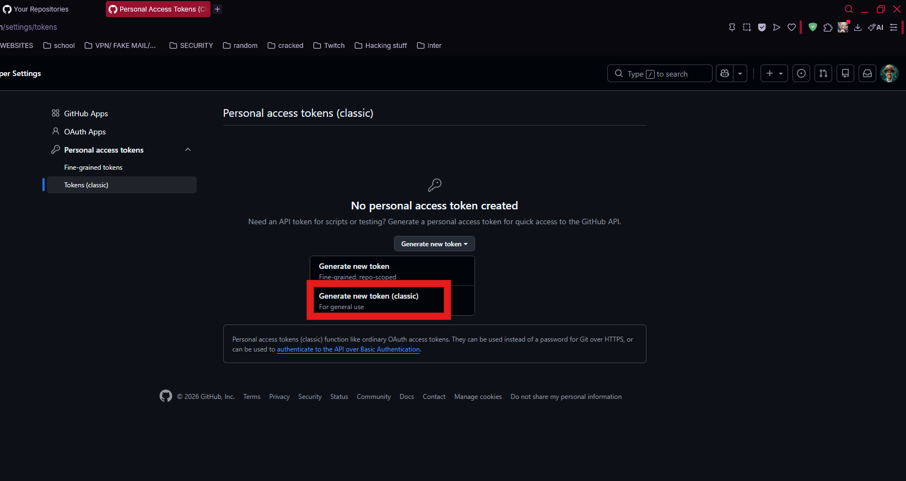
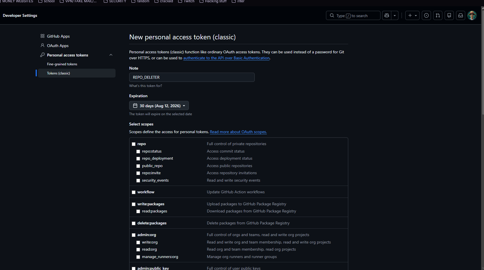
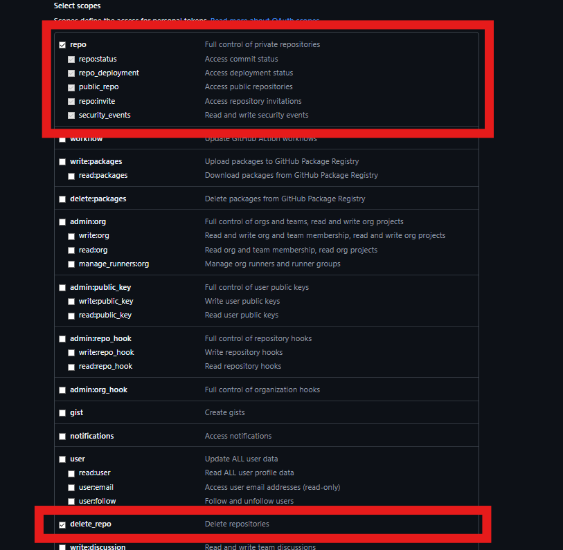
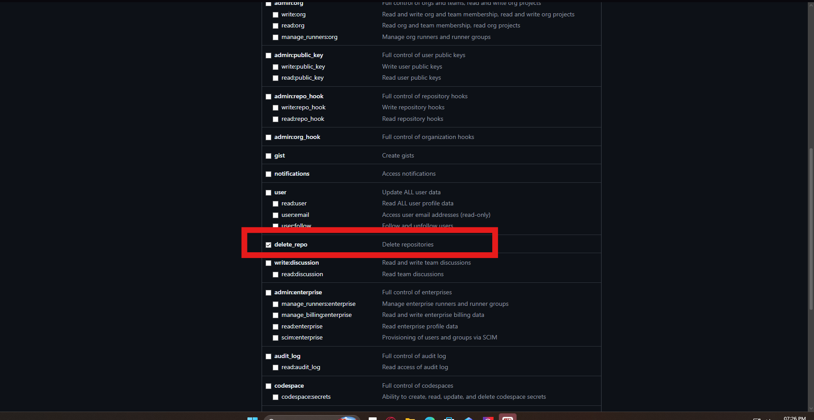
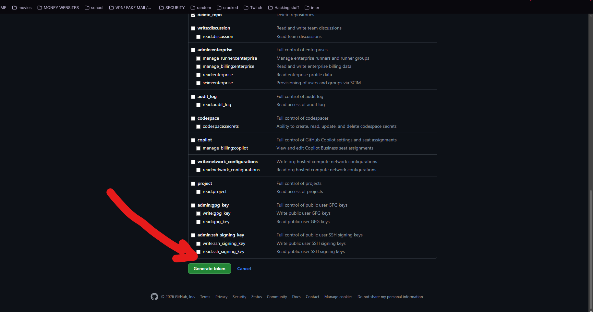
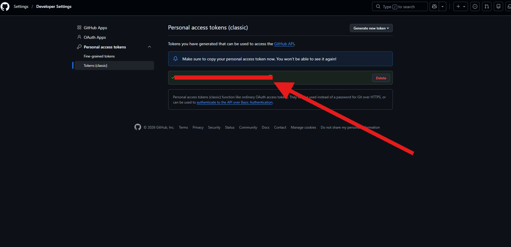
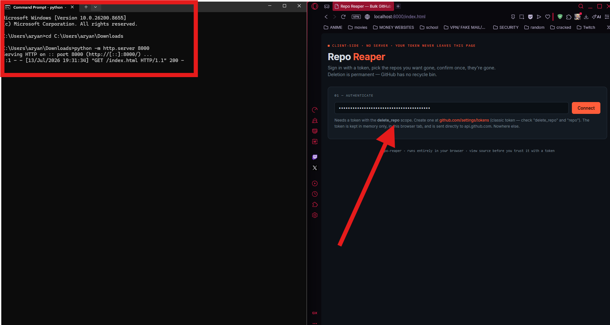
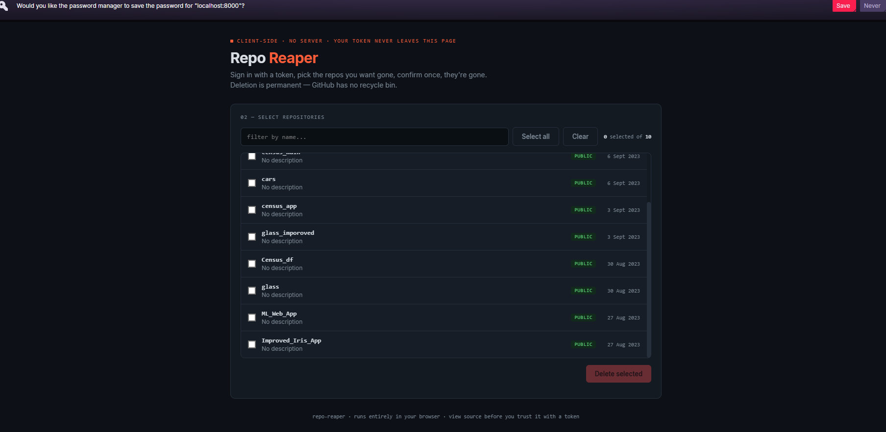
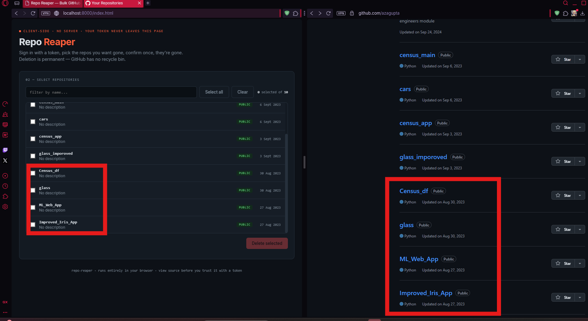

# QuickRepoDeleter

> **Disclaimer:** This tool permanently deletes GitHub repositories with no way to undo it. Use it at your own risk. The author is not responsible for any data loss, deleted repositories, or other damages resulting from use of this tool verify your selections carefully before confirming. This project is provided "as is," with no warranty of any kind, per the MIT license.

Bulk-delete GitHub repositories from a single page. Sign in with a personal access token, multi-select repos, confirm once, they're gone.

> Note: the actual file in this repo is named `index.html`, not `QuickRepoDeleter.html`. That's intentional — GitHub Pages only auto-serves a file called exactly `index.html` at a repo's root. Keep that filename or your Pages link 404s and needs the filename typed on the end. `QuickRepoDeleter` is the project's name, not the file's.

## Why this exists

GitHub doesn't make bulk deletion easy — it's one-by-one through Settings, or writing your own CLI script. Both are more hassle than they should be, so I built a UI that shows exactly what you're about to delete before you delete it.
## How it works

- Runs entirely in your browser. No backend, no server, nothing stored.
- You paste a GitHub Personal Access Token (classic) with the `delete_repo` scope.
- The token is kept in memory in the page only, for that session. It is sent directly to `api.github.com` and nowhere else.
- The token is never logged, stored, or transmitted to any server controlled by this project — check the source below to verify.

## Setup

1. Create a token at [github.com/settings/tokens/new](https://github.com/settings/tokens/new?scopes=delete_repo,repo&description=Repo%20Reaper)
   - Classic token
   - Check `delete_repo` and `repo` scopes
   - Set an expiration — don't use "no expiration" for a token with delete rights
2. Open the live tool (or `index.html` locally)
3. Paste the token, click Connect

## Walkthrough

1. Go to GitHub → Settings → Developer settings → Personal access tokens → **Generate new token (classic)**.
   
2. Give it a name you'll recognize later, set an expiration.
   
3. Check the top-level **`repo`** box (full control of private repositories). This is what makes private repos show up in the list — `delete_repo`.
   
4. Scroll down and also check **`delete_repo`**.
   
5. Click **Generate token**.
   
6. Copy the token immediately and note it down somwhere. Store it somewhere safe and never post it anywhere public, including chat, forums, or commit history.
   
7. In a terminal, `cd` to wherever you saved `index.html` (Downloads by default), run `python -m http.server 8000` (or `python3` on Mac), then open `http://localhost:8000/index.html` in your browser. Paste the token into the Authenticate field.
   
8. If your browser offers to save the token as a password, click **Never** — it's a bearer token, not a login, and doesn't belong in a password manager's sync.
   
9. Once connected, your repos load — public and private both, assuming step 3 was done. Select the ones you want gone and click Delete selected. The result matches what's actually on GitHub, side by side.
   

### Video demos

- https://www.image2url.com/r2/default/videos/1783972289719-404fc975-50b5-4014-ba7c-6110b89b0531.mp4 — full flow on Windows
- https://www.image2url.com/r2/default/videos/1783973803675-94918620-ef64-47e3-a59b-c207b3c110fc.mp4 — full flow on Mac

Also video files in `demos/` folder in the repo (needs to be downloaded). GitHub renders an inline video player automatically for `.mp4`/`.mov` files referenced with a normal markdown link when they're committed to the repo:


## Safety

- Deletion is permanent. GitHub has no recycle bin or undo.
- A confirmation modal lists every repo you're about to delete and requires typing `DELETE` before it will proceed.
- Deleting a repo removes its issues, pull requests, wiki, and stars along with it.

## Trust and verification

This page asks for a token with delete rights on your repos. That is a legitimate reason to be suspicious of any page that asks for it, including this one. Before pasting a token in:

- Read `index.html` in this repo. It's a single file, plain JavaScript, no build step, no obfuscation. Every network call it makes is visible in the source.
- Confirm it only calls `api.github.com`.
- If you don't want to trust the hosted version, clone the repo and run it locally instead (see below).

## Running locally

Keep `index.html` in your **Downloads** folder. That's the default location every terminal opens near, so you don't have to hunt for it or move it around — and if you ever want it gone, it's just a normal file to delete, no uninstall needed.

### Mac

1. Save `index.html` into `~/Downloads` (default Downloads folder — don't rename it).
2. Open **Terminal** (Spotlight → type `Terminal` → Enter).
3. Run:
   ```bash
   cd ~/Downloads
   python3 -m http.server 8000
   ```
4. Open your browser and go to `http://localhost:8000/index.html`
5. When you're done, go back to Terminal and press `Ctrl + C` to stop the server.

Mac ships with Python 3 pre-installed, so no setup needed. If `python3` isn't found, install it from [python.org](https://www.python.org/downloads/) first.

### Windows

1. Save `index.html` into your **Downloads** folder (`C:\Users\YourName\Downloads`).
2. Open **Command Prompt** (Start menu → type `cmd` → Enter) or **PowerShell**.
3. Run, replacing `YourName` with your actual Windows username:
   ```cmd
   cd C:\Users\YourName\Downloads
   python -m http.server 8000
   ```
   (Or use `cd %USERPROFILE%\Downloads` if you don't want to type your username manually — both do the same thing.)
   (If `python` isn't recognized, install it from [python.org](https://www.python.org/downloads/) — during install, check "Add python.exe to PATH".)
4. Open your browser and go to `http://localhost:8000/index.html`
5. When you're done, go back to the terminal window and press `Ctrl + C` to stop the server.

### Deleting it later

The tool doesn't install anything or write files anywhere else on your system — it's a single HTML file plus whatever Python already had installed. To remove it, just delete `index.html` from Downloads. There's nothing else to clean up.

## License

MIT — see LICENSE.
